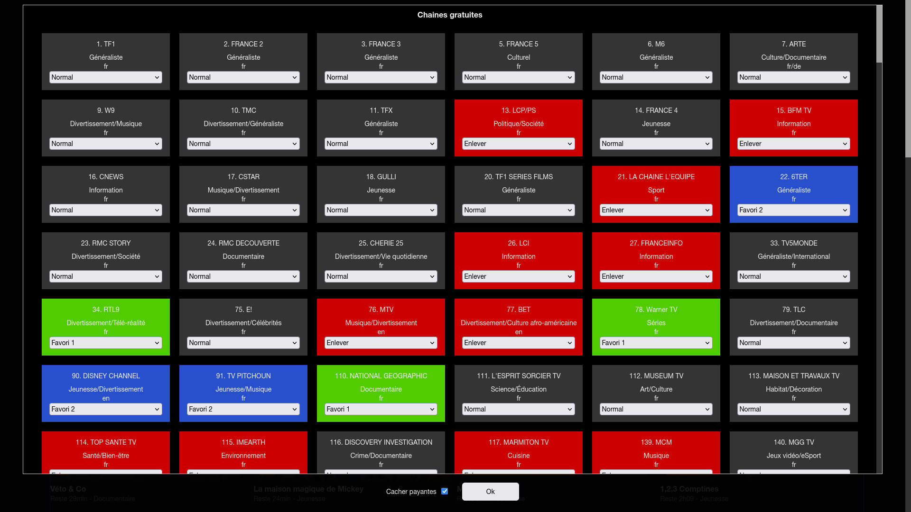

# cleantvorange
Script Tampermonkey pour nettoyer le site tv d'orange, pour une meilleure lisibilité des chaines en cachant les non souhaitées, avec mise en avant des favorites.

Le site orange tv affiche trop de chaines(mauvaises langues ou bien payantes) 320 en tout, on ne s'y retrouve plus.
Ce script pour Tampermonkey permet de choisir les chaines à cacher pour enlever les inutiles, puis de pouvoir mettre en avant les chaines que l'on regarde le +.

